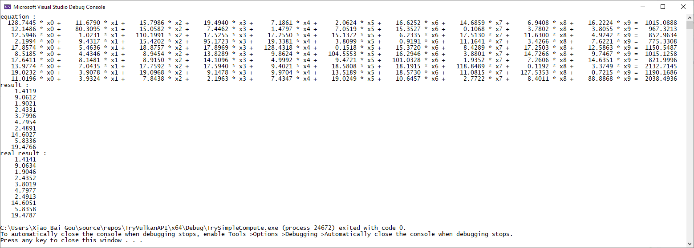
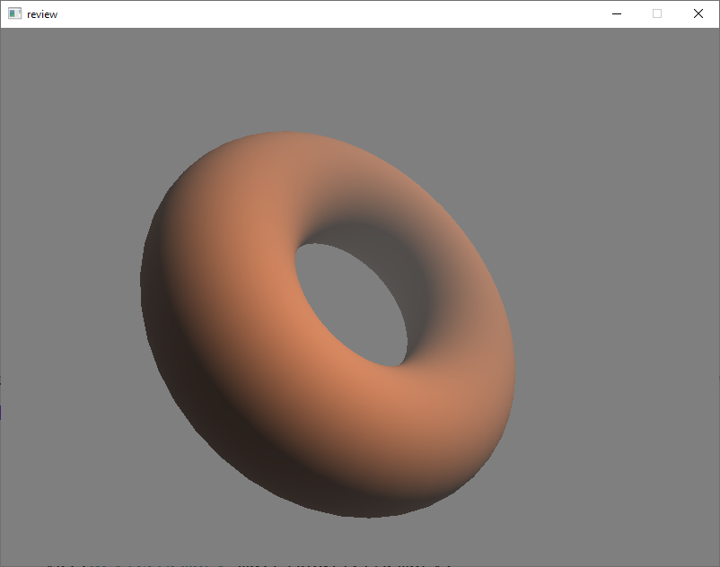
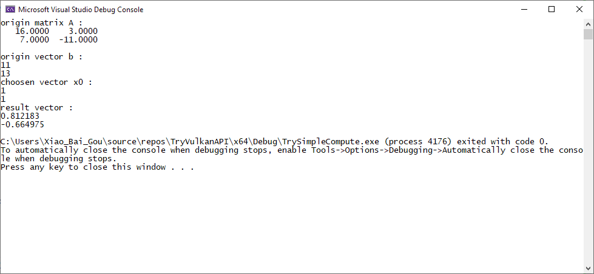
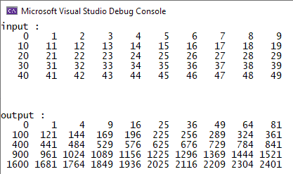

# TryVulkanAPI

~~就简单试试。。。~~

Vulkan真*&($难

#### Jacobi收敛条件杀我QuQ

标准的收敛情况下迭代矩阵的谱半径需满足：
$$
\rho(D^{-1}R)<1
$$
保证收敛的条件是矩阵*A*为严格或不可约的对角占优矩阵。严格的行对角占优矩阵指对于每一行，对角线上的元素之绝对值大于其余元素绝对值的和，即：
$$
|a_{ii}|>\sum^{}_{j\neq{i}}{|a_{ij}|}
$$

#### Foggy Torus

#### 使用GPU减速的Gauss–Seidel method

#### 尝试拿compute shader算平方。。。

#### 带贴图还做了深度测试的方块块

#### 带贴图的方块块

